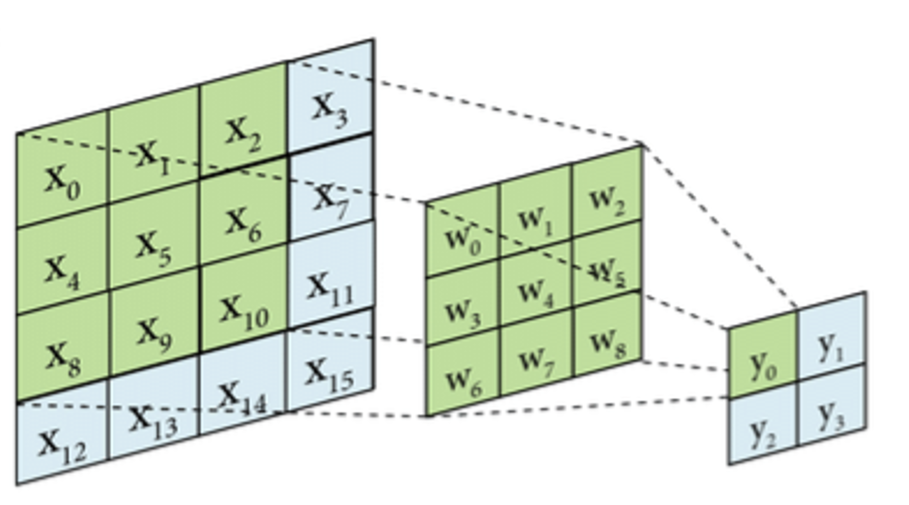
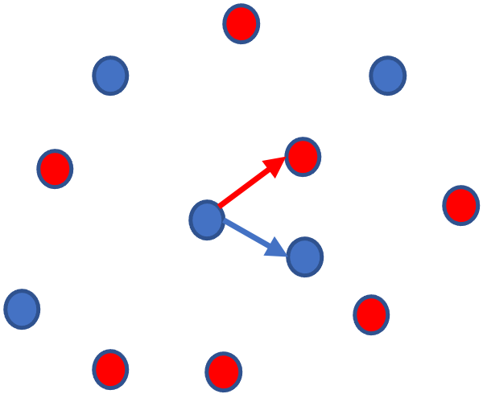
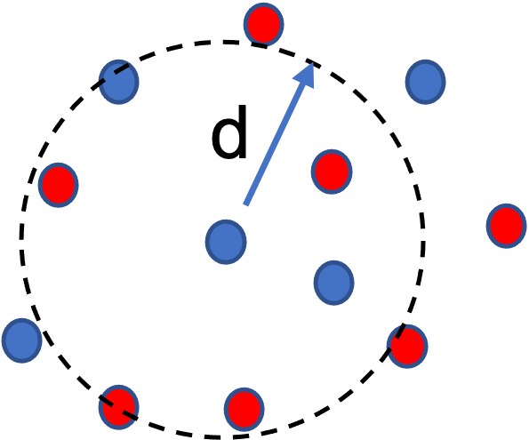
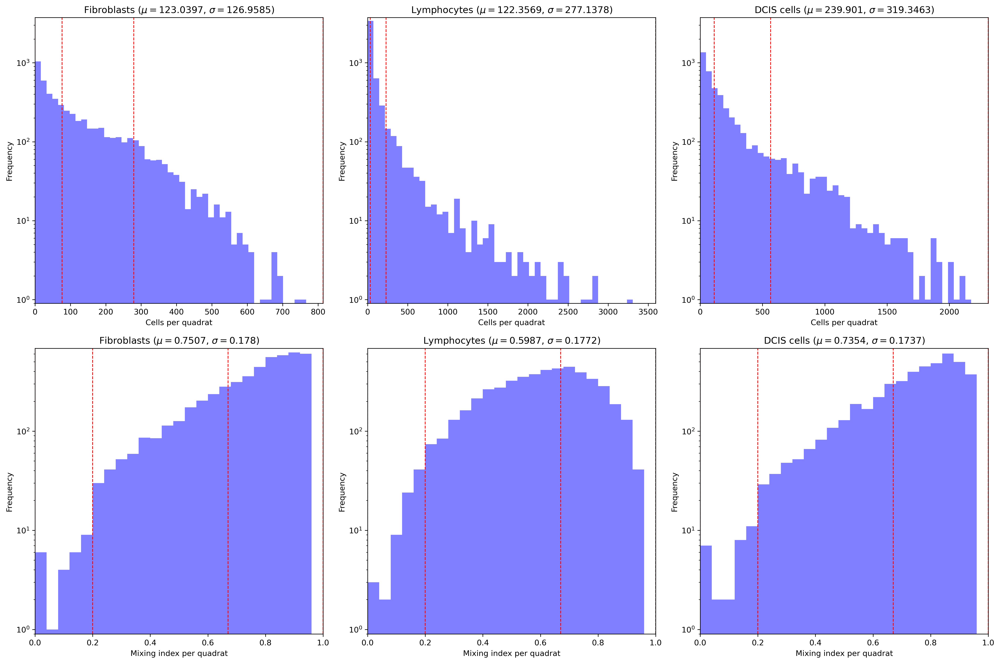
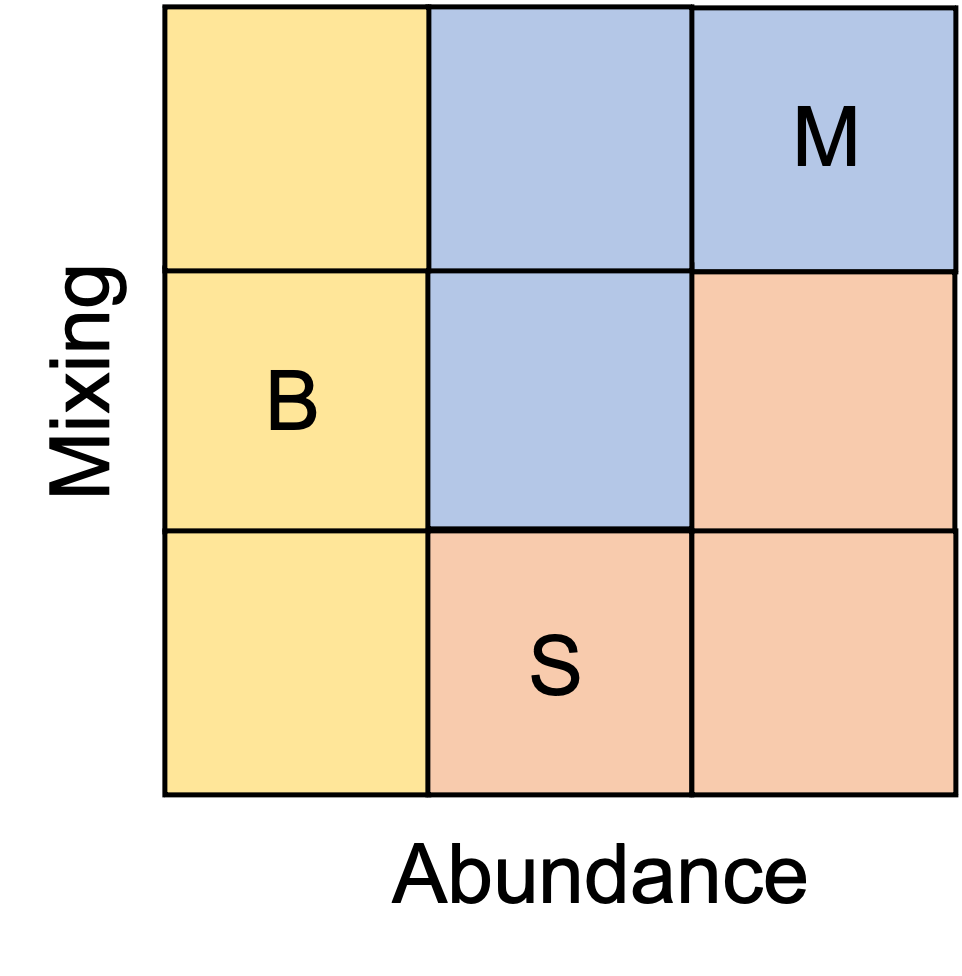

# Tumor Landscape Analysis (TLA)
 
Landscape ecology analysis methods for the investigation and characterization of digital histopathological data of tumor biopsies.


## Introduction

Landscape ecology is the study of interactions and relationships between living organisms and the environment they inhabit. Such environment is defined as a __landscape__ (spread in space and time) occupied by different species of organisms, and its description entails details on spatial distributions, cohabitation, population dynamics, mobility and other ecological questions.

A __landscape mosaic__ consist of spatial locations and categorical classification of all ecological entities of interest. Typically such data is recorded as a __categorical raster image__ (a 2D array with discrete categorical labels representing locations of all surveyed individuals in a particular moment in time, with different categories representing species or classes), or an equivalent long-form table of individuals with their corresponding coordinates and category values. 

Landscape metrics algorithms have been implemented in packages such as [FRAGSTATS](http://www.umass.edu/landeco/research/fragstats/fragstats.html), [landscapemetrics](https://r-spatialecology.github.io/landscapemetrics/) (R) or [pylandstats](https://pylandstats.readthedocs.io/en/latest/index.html) (python) support raster spatial objects. Because these algorithms work with categorical data, each cell in the array is assigned to a discrete class identifier. Therefore there is an inherent spatial resolution of the data given by the discrete location values. We will refer to this resolution as the "pixel resolution" of the data.

__Landscape metrics__ are measures that quantify physical characteristics of landscape mosaics in order to connect them to ecological processes. These tools help characterize a landscape, primary describing its composition and spatial configuration: 

- The __composition__ of a landscape accounts for how much of the landscape, or a specified region of it, is covered by a certain category type
- The __configuration__ describes the spatial arrangement or distribution of the different category types. 

Additionally, landscape metrics can be calculated for three different levels of information scopes:

1.	__Patch level metrics:__ a patch is defined as neighboring cells belonging to the same class, typically using Moore's, or sometimes von Neumann's, neighborhood rules. Patch level metrics are calculated for each patch in the landscape.
2. __Class level metrics__: returns a summary value for all patches aggregated by type class. The output is typically some statistics of patch level metrics across all patches in each class (e.g. a sum or mean). 
3. __Landscape level metrics__: returns a single value describing a global property of the landscape. This is typically a statistics of metrics of lower levels aggregated by patches and/or classes. 

Our goal is to implement these methodologies in the study of tissues, perceived as cellular ecologies in the context of tumor development, and observed by means of digital histopathological samples. The data used for this analysis typically comes from a cell segmentation and classification process, which consist of image processing and machine learning algorithms that are capable of identifying individual cells from a histopathological image, returning the pixel location of their centers and a class category that indicates the cell type. This data is provided to TLA as numerical data. Additional data consist of _ad hoc_ segmentation of regions in the tissue, also detected by image processing techniques, that identify specific tissue compartments of interest; for instance ducts or crypts where neoplastic epithelial cells might form tumors or cellular niches.


### Classes of landscape metrics

There are different classes of landscape metrics:

1.	__Area and edge metrics__: describe the aggregated area and length of the edge of patches or classes. The __edge__ is defined as the border perimeter of patches. These metrics mainly characterize the composition of the landscape and evaluate dominance or rareness of classes.
2.	__Shape metrics__: describe the shape of patches, typically in terms of the relationship between their area and perimeter but also including or other metrics that describe the overall geometry of each patch (like fractal dimension, roundness, etc). 
3.	__Core area metrics__: describe the area of the fraction of each patch that is not an edge, providing information about areas that are not influenced by neighboring patches of a different class.
4.	__Contrast metrics__: describe the magnitude of the difference between adjacent patch types with respect to one or more ecological attributes. 
5.	__Aggregation metrics__: describe the level of clumpiness of patches of the same class, providing information on whether patches or a certain class tend to be aggregated in space or isolated. These metrics describe the spatial configuration of the landscape.
6.	__Diversity metrics__: available on the landscape level, these metrics describe the abundance and dominance/rareness of classes and show the diversity of classes in the landscape.
7.	__Complexity metrics__: provide information theory-based measures, like entropy and mutual information, to characterize patches of given classes.  

### Metric statistics

Toolboxes like __pylandstats__ (which is implemented within TLA) feature six specific distribution metrics for each patch-level metric, consisting of statistical aggregation of the values computed for each patch of a class or the whole landscape.

In what follows we refer to the following notation:  

- __a<sub>i,j</sub>, p<sub>i,j</sub>, h<sub>i,j</sub>__ represent the area (__a__), perimeter (__p__), and distance to the nearest neighboring patch of the same class (__h__) of the patch __j__ of class __i__.
- __e<sub>i,k</sub>, g<sub>i,k</sub>__ represent the total edge (__e__) and number of pixel adjacencies (__g__) between classes __i__ and __k__.
- __A, N, E__ represent the totals of area (__A__), the number of patches (__N__) and edge (__E__) of the landscape

The six basic implemented distribution metrics, calculated across patches (and done at the class-level or landscape-level), are:

1.	__Mean__: specified by the suffix `_mn` to the method name, e.g. `area_mn`. 
2.	__Area-weighted mean__, specified by the suffix `_am` to the method name, e.g. `area_am`. This is the mean value weighted by the path size.
3.	__Median__, specified by the suffix `_md` to the method name, , e.g. `area_md`. 
4.	__Range__, specified by the suffix `_ra` to the method name,  e.g. `area_ra`.
5.	__Standard deviation__, specified by the suffix `_sd` to the method name,  e.g. `area_sd`
6.	__Coefficient of variation__, (or variance) specified by the suffix `_cv` to the method name,  e.g. `area_cv`


### Spatial Statistic Factors

In order to get local measures of spatial statistics (aka spatial factors), a landscape is segmented into quadrats for which each statistics is evaluated. In many cases, each quadrat is further segmented into sub-quadrats in order to perform the spatial calculations. The calculated index is then assigned to the whole quadrat. 
This TLA implementation use a convolution smoothing function:
<div align="center">

</div>
<div align="center">
</div>
with _w_ the weighted kernel for the spatial convolution.
TLA uses a circular kernel with uniform weights as a replacement for quadrats, and sub-quadrats. Thus Instead of segmenting the landscape into a grid to estimate spatial statistics, it estimates the statistical measure in each kernel around each pixel. 
This allows for calculating full resolution fields in a computationally efficient way.


#### 1. Colocalization index

Pairwise Morisita-Horn index between two classes is measured in each region _(x,y)_ as the overlap of the spatial distributions:

<div align="center">
 </div>

with the distributions of abundances of "ref" species _r_ and "test" _t_ species in each sub-region _i_ of the _(x,y)_ region given as:

<div align="center">
</div>

This index measures the degree of overlap between the two spatial distributions, telling whether the two distributions are similar or not:

* _M_ ~ 0: ref and test cells are excluded from each other
* _M_ ~ 1: ref and test cells are similarly distributed in space

__Attention:__ this measure is very sensitive to low seeding.  Particularly when one or both distributions have a many sub-regions with zero abundance. Namely, when the number of points of a particular cell type is significantly less than the number of sub-regions (i.e. less than one cell per sub-region in average) it's statistically impossible to distinguish discrete realizations of a non-uniform distribution from a low-seeded uniform distribution. Therefore for low-seeding cases, the Morisita-Horn index could be inflated, and not trustworthy.

This measure is symmetric, and the spatial profiles characterize the prevalence and heterogeneity in colocalization of two cell types. All pair combinations are calculated.


#### 2. Nearest Neighbors index

Measures the enrichment of nearest neighbors between pairs of cell type classes, "ref" cell type (blue dots) and the "test" cell type (red dots):
<div align="center">

</div>
For each ref cell the distance to closest ref cell _d<sub>min</sub>(r)_ and the distance to the closest test cell _d<sub>min</sub>(t)_ are found and averaged in each region _(x,y)_, then the index is given by the ratio:
<div align="center">
</div>

This measure has the properties:

* _N_ > 0: if ref and test cells are segregated from each other, meaning next to a ref cell is more likely to find another ref cell than a test cell.
* _N_ ~ 0: if ref and test cells are well mixed together, meaning the next to a ref cell is equally likely to find a ref cell or test cell
* _N_ < 0: if ref cells are individually infiltrated, meaning that next to a ref cell is more likely to find a test cell than a ref cell. This will happen if test cell are mixed in but much less abundant.

This measure is different from the colocalization score in that it captures the character of cell-cell closeness between different cell types, typically imposing a weaker condition than overall spatial distribution similarity. Namely, if two cell types are "colocalized" in the Morisita-Horn index sense (_M_ ~ 1) then typically _N_ ~ 0, but the converse is not necessarily true: two cell types can be "proximal to each other", _i.e._  _N_ ~ 0, and still have very different spatial distributions, specially if the abundances of the two types is very different. Therefore the spatial profiles of this factor characterize the heterogeneity in mixing of cells in terms of their typical observed proximity.

This is an asymmetric pairwise measure that is sensitive to relative abundance of cells.


#### 3. Ripley’s H Index 

This factor measures relative clustering of points as a function of scale of the scope. In this case, for a given radius _d_ and cell types "ref" (blue dots) and "test" (red dots):
<div align="center">

</div>
For each ref cell in a given region _(x,y)_ we calculate the number of test cells _I<sub>rt</sub>(d)_ inside a radius _d_ from it. The mean across all ref cells in _(x,y)_ normalized by the density λ<sub>t</sub> of test cells gives the Ripley's _K_ function:

<div align="center">
</div>

If the distribution of test points is homogeneous, the expected value of _I_ should approach _E = Aλ<sub>t</sub>_ with _A_= πd<sup>2</sup> the area of the circle. Therefore _K_ is given by the proportion of observed to expected points in the circle. The more practical _H_ function is defined as:

<div align="center">
</div>

This is a measure of the level of clustering of test cells around ref cells at the scale _d_. Typically, this measure is used to assess the structure of a spatial distribution, generating a curve as a function of _d_ that characterize how the clumping changes with the distance, leading to estimation of natural scales and correlation distances in the system. Given that TLA generates local estimates of each factor, it uses only one arbitrary value, _d_ equals sub-region size, to evaluate the Ripley's H function as a spatial factor. It has the following properties:

* _H_ > 0: if test cells cluster around ref cells
* _H_ ~ 0: if ref and test cells are mixed uniformly
* _H_ < 0: if test cells are excluded from ref cells

This is yet another factor that describes the mixing of two class types in a slightly different way. This measure refers to the level of clumping at a specific scale _d_. It is a way related to the Nearest Neighbor index, more stringent in the continuous aspect of the cell's spatial distribution but yet limited to a length scale. Therefore, this is an intermediate approach in terms of spatial distribution comparisons. 

This is not only an asymmetric measure, but also not an identity. Applying the measure on ref cells with themselves (i.e. test cells are the same as ref cells) does not necessarily return a trivial identity value, but a measure of the degree of clumping of ref cells with themselves, producing a measure of clustering. Pairwise comparisons give a measure of relative clumping, or clustering, of test cells __around__ ref cells. 


#### 4. Getis-Ord Z score and HOT index

This is a standard measure of enrichment of cell abundance with respect to the total study area (landscape). It consist of a general inferential _Z_ statistic, tested in the context of the null hypothesis. See [ArcGIS documentation](https://pro.arcgis.com/en/pro-app/2.8/tool-reference/spatial-statistics/h-how-high-low-clustering-getis-ord-general-g-spat.htm) for mathematical expressions and definitions.

The null hypothesis states that there is no spatial clustering of feature values. When the corresponding p-value is statistically significant the null hypothesis can be rejected in one of two ways according to the sign of the z-score: if positive, the observed index is larger than expected, indicating that high values for the attribute (cell abundance) are clustered in the study area. If the z-score value is negative, the observed index is smaller than expected indicating that low values for the attribute (cell abundance, hence depletion) are clustered in the study area.

Along with a spatial factor for the z-scores, TLA generate a HOT factor consisting of:

* HOT ~ 1: if region _(x,y)_ has more cells than expected
* HOT ~ 0: if region _(x,y)_ has a expected density (null hypothesis cannot be rejected)
* HOT ~ -1: if region _(x,y)_ has less cells than expected

These spatial profiles characterize hotspots in relation to the __whole study area__ (sample landscape), indicating regions of abundance or depletion for each cell type. Overlaps for different classes can be generated to detects mutual hot/cold spotting in different combinations. 


### Spatial Stratified Heterogeneity detection

Spatial heterogeneity refers to non-uniform distribution of spatial factors within an area. Environments can have a variety of habitats, such as different topographies and ecological diversities capable of accommodating more or less interacting species: when organisms can finely partition a landscape into distinct suitable habitats (or niches), more species can coexist with minimal competition.

Spatial stratified heterogeneity refers to a situation in which landscape strata, such as ecological zones or classes, present distinct profiles for spatial factors such that within strata variance is less than the between strata variance. This indicates that the stratification is somewhat predictive or well correlated to the intensity profile of the spatial factor.

Please refer to documentation for the R package [geodetector](https://cran.r-project.org/web/packages/geodetector/vignettes/geodetector.html) for more details, definitions and examples.

#### 1. SSH Factor detector

The factor detector q-statistic measures the Spatial Stratified Heterogeneity (SSH) of a spatial factor _Y_ in relation to a categorical variable _X_ (strata). This is also known as the determinant power of a covariate _X_ of _Y_. Outputs include the following statistics:

* __q-statistic__: The q-statistic measures the degree of SSH: 
	- __q~1__ indicates a strong stratification: small within-strata
variance and/or large between-strata variance. Thus a strong association between the explanatory variable and the explained variable (ie. strata categories explain the data)
	- __q~0__ no stratification: within-strata variance is large and/or between-strata variance is small. Thus there is no relationship between the strata categories and the data.
* __F-statistic__: F-value, assuming a random non-central F-distribution
* __p-value__: Prob that the q-value is observed by random chance. The null hypothesis is defined as absence of within-stratum heterogeneity (__q~0__):
	- __H<sub>0</sub>__: there is no SSH (stratification is not significant), thus within and between strata heterogeneity are similar.
	- __H<sub>1</sub>__: there is SSH (stratification is significant), thus within-strata heterogeneity is significantly smaller than between-strata heterogeneity.

#### 2. SSH Interaction detector

The interaction detector function reveals whether risk variables
_{X<sub>1</sub>, X<sub>2</sub>}_ have an interactive influence on a factor _Y_. Outputs a table for the interactive q-statistics between variables, accounted by measuring the effect of merging _X<sub>1</sub>_ and _X<sub>2</sub>_ together in a new category defined by their union, giving the possible outcomes:

* __"equivalent"__ if q(X1∩X2) = q(X1) = q(X2)
* __"weaken"__ if q(X1∩X2) < q(X1) + q(X2)
* __"weaken, nonlinear"__ if q(X1∩X2) < q(X1) and q(X2)   
* __"max(q(X1),q(x2)) weaken (uni-)"__ if q(X1∩X2) < max(q(X1),q(x2))
* __"max(q(X1),q(x2)) weaken; min(q(X1),q(x2)) enhance"__ if min(q(X1),q(x2)) < q(X1∩X2) < max(q(X1),q(x2))
* __"min(q(X1),q(x2)) enhance (uni-)"__ if min(q(X1),q(x2)) < q(X1∩X2) 
* __"independent"__ if q(X1∩X2) = q(X1) + q(X2)
* __"enhance, nonlinear"__ if q(X1∩X2) > q(X1) + q(X2)
* __"enhance, bi-"__ if q(X1∩X2) > q(X1) and q(X2)
   
#### 3. SSH Risk detector

This function calculates the average values in each stratum of the explanatory variable _X_, and reports if a significant difference between any two strata levels exists, indicating that the factor is a risk factor for the stratification structure. It outputs means of explained variable in each stratum and the t-test for differences every pair of strata (with the corresponding multiple comparison correction for p-values)

#### 4. SSH Ecological detector

This function identifies the impact of differences between two risk factors _X<sub>1</sub>_ and _X<sub>2</sub>_  returning the significance test of impact difference between them.

The probability value is calculated from the positive tail of the cumulative F-statistic given by the ratio of the two factors individual F-statistics. The significance of this measure indicates that the two stratifications _X<sub>1</sub>_ and _X<sub>2</sub>_ are statistically distinct in terms of risk.

## References:

1. Mcgarigal, K., Cushman, S., & Ene, E. (2012). FRAGSTATS v4: Spatial Pattern Analysis Program for Categorical and Continuous Maps. Retrieved from http://www.umass.edu/landeco/research/fragstats/fragstats.html
2. Hesselbarth, M. H. K., Sciaini, M., With, K. A., Wiegand, K., & Nowosad, J. (2019). landscapemetrics: an open-source R tool to calculate landscape metrics. Ecography, 42(10), 1648–1657. https://doi.org/10.1111/ecog.04617
3. Nowosad, J., & Stepinski, T. F. (2019). Information theory as a consistent framework for quantification and classification of landscape patterns. Landscape Ecology, 34(9), 2091–2101. https://doi.org/10.1007/s10980-019-00830-x
4. Wolda H. Similarity indices, sample size and diversity. Oecologia. 1981 Sep;50(3):296-302.
5. Magurran A.E. (2005) Biological diversity. Curr Biol 15:R116-8
6. Rempala G.A., Seweryn M. (2013) Methods for diversity and overlap analysis in T-cell receptor populations. J Math Biol 67:1339-68
4. Altman, Naomi S. (1992). "An introduction to kernel and nearest-neighbor nonparametric regression". The American Statistician. 46 (3): 175–185.
4. Everitt, Brian S.; Landau, Sabine; Leese, Morven; and Stahl, Daniel (2011) "Miscellaneous Clustering Methods", in Cluster Analysis, 5th Edition, John Wiley & Sons, Ltd., Chichester, UK
4. Bosch, M. (2019). PyLandStats: An open-source Pythonic library to compute landscape metrics. BioRxiv, (October), 715052. https://doi.org/10.1101/715052
5. Ripley, B.D. (1976). "The second-order analysis of stationary point processes". Journal of Applied Probability. 13 (2): 255–266. doi:10.2307/3212829. JSTOR 3212829.
6. Dixon, Philip M. (2002). "Ripley's K function". In El-Shaarawi, Abdel H.; Piegorsch, Walter W. (eds.). Encyclopedia of Environmetrics. John Wiley & Sons. pp. 1796–1803. ISBN 978-0-471-89997-6.
5. Getis, Arthur, and J. K. Ord. "The Analysis of Spatial Association by Use of Distance Statistics." Geographical Analysis 24, no. 3. 1992.
6. Mitchell, Andy. The ESRI Guide to GIS Analysis, Volume 2. ESRI Press, 2005.
7. Wang JF, Li XH, Christakos G, Liao YL, Zhang T, Gu X, Zheng XY.
Geographical detectors-based health risk assessment and its application in the neural tube defects study of the Heshun Region, China. International Journal of Geographical. Information Science, 2010, 24(1): 107-127.
7. Wang JF, Zhang TL, Fu BJ. 2016. A measure of spatial stratified heterogeneity. Ecological Indicators 67: 250-256.
8. Wang JF, Xu CD. Geodetector:Principle and prospective. Geographica
Sinica, 2017, 72(1):116-134.
8. Jiang B. 2015. Geospatial analysis requires a different way of thinking: The problem of spatial heterogeneity. GeoJournal 80(1), 1-13.
9. Song, Y and Wu, P (2021). “An interactive detector for spatial associations”. International Journal of
Geographical Information Science. doi:10.1080/13658816.2021.1882680
---
---
---


## TLA pipeline usage guideline

TLA is a python program that computes spatial statistics, implementing functions from the landscape ecology package [pylandstats](https://github.com/martibosch/pylandstats), astronomical and GIS spatial statistics ([astropy](https://www.astropy.org/), [pysal](https://pysal.org/esda/index.html)), spatial stratified heterogeneity ([geodetector](https://cran.r-project.org/web/packages/geodetector/vignettes/geodetector.html)) and image processing methods ([scipy](https://scipy.org/), [scikit-image](https://scikit-image.org/)).

Two novel aspects are of significance in TLA:

1. Spatial statistics are calculated locally. This is generally done using a quadrat approach, which produces spatial profiles of different metrics, rather than a single sample-level value.
2. The quadrat approach inherently reduces the resolution of the landscape, as any feature with a length scale smaller than the size of a quadrat can't be resolved. But adopting the principle of spatial smoothing from image processing, using spatial convolution functions with a circular or gaussian kernel instead of a quadrat grid, all statistics are calculated at the pixel level. 


### TLA script

Bash script `TLA` is part of the TLA repository and is all what is really needed to run all the analyses. 

There are three basic TLA modules (or actions): 

1. `TLA setup` pre-processes data, including cell filtering, creation of raster arrays and estimation of study-level profiles for cell density and mixing, which are used to define local microenvironment categories (LME) that are consistent across the whole cohort.
2. `TLA run` runs the main TLA analysis, including calculation of spacial statistic factors and patch analysis using defined LMEs. Patch, class and landscape level statistics are performed and recorded in output tables.
3. `TLA ssh` runs spatial stratified heterogeneity analysis using previously calculated spatial statistic factors. 

Since cohort-level analysis depends of details of the study design (eg. cohorts or groups of progression and controls) which specify the type of desired comparisons and statistics, it is left out of this distribution of TLA. Specific projects would typically have  tailored post-processing scripts written in R for this purpose. 


Usage: 

If the virtual environment is not yet activated:

```
> conda activate
``` 

then, each module is ran with the syntax: 

```
> ./TLA {action} {argument table} [TRUE/FALSE]

``` 

#### Direct use from python

TLA scripts can be run directly from python, this is a simple option when the bash script doesn't work (eg from a Windows system). In these cases use the option `--redo` if you want to redo the analysis (ie. redo set to `TRUE`).

1. To run `TLA setup` use the following instructions:

```
> python source/tla_setup.py {argument table} [--redo]
```

2. To run `TLA run` use the following instructions:

```
> python source/tla.py {argument table} [--redo]
```

1. To run `TLA ssh` use the following instructions:

```
> python source/tla_ssh.py {argument table} [--redo]
```

#### Argument table

This is a comma separated file (CSV) containing the main arguments for all TLA modules, and it must be produced by the user. The example `test_set.csv` is provided as a template. 

Typically this table would have only one row containing argument values for a single study. On the other hand a study includes a number of biopsies to be analyzed and compared together. 

TLA allows for batch processing of multiple studies if several rows are added in this table. Notice that the assumption is that there is no connection between different studies, so no comparisons or joined statistics will be calculated between them. 

The arguments for a study are:

1. `name`: (str) name to identify the study.
2. `raw_path`: (str) path to the location of the study raw data
3. `raw_samples_table`: (str) name of raw samples table (CSV). This table has all the relevant information for each individual sample in the study. 
4. `raw_classes_table`: (str) name of classes table for this study.
5. `data_path`: (str) path to the location of the study pre-processed data, which will be accessed by TLA. 
5. `scale`: (float) scale of pixels in physical units (units/pixel)
6. `units`: (str) name of physical units (e.g. `[um]`) 
7. `binsiz`: (float) size of quadrat (kernel) binning for coarse graining.
8. `BLOBS`: (bool) if `True` then a mask image with _ad hoc_ regions of interest will be used to mask cells. In this case cells outside of blobs are reclassified as `LOW_DENS_CODE` and those inside blobs are reclassified as `HIGH_DENS_CODE`. 
9. `DTHRES`: (float) threshold for filtering target cell type according to cell density. Use the value `0` to turn this feature off.
10. `FILTER_CODE`: code of targeted cells for filtering (typically tumor or epithelial cells)
11. `HIGH_DENS_CODE`: code assigned to targeted cells in high density areas (and inside regions of interest defined by the blob mask)
12. `LOW_DENS_CODE`: code assigned to target cells in low density areas (or outside regions of interest defined by the blob mask)


## Pre-Processing Module: `TLA setup`

Usage example: 

```
> ./TLA setup test_set.csv

``` 

Prepares data for TLA according to parameters in the argument table:

#### Samples table:

The argument __raw\_samples\_table__ points to a table of samples with the following fields:

1. `sample_ID`: (str) unique identifier for each sample.
2. `coord_file`: (str) name of the coordinate file (CSV) for this sample. These are raw coordinates that will be curated during pre-processing. __ATTENTION:__ The format of this file __must be__  `['class', 'x', 'y']`, with these _exact_ column names; any additional info in this file (like annotations for each cell) will be ignored. Cleaned out data files are cached to be used in downstream analysis (including the additional info). BUT only cell classes defined in the classes table and cells that pass the filtering process are kept. Also for practical convenience coordinate values are reset to relevant margins.
3. `image_file`: location and name of the image file for this sample. These images are adjusted to match coordinates of the coordinates convex hull, and copies are cached. If an image is not available leave the field blank.
4. `mask_file`: location and name of the corresponding mask file for this sample. Mask are used to identify large scale regions (blobs), like ducts, crypts, DCIS, different tissue components, etc. It can be either a binary mask or a raster image with integer labels identifying different blob patches. These images are also adjusted and cached. If a mask image is not available leave the field blank.
5. Additional variables, like clinical annotations and/or sample details, will be carried over to result outputs to be accessible by processing and post-processing modules.

#### Classes table:

The argument __raw\_classes\_table__ points to a table of cell categories with the following fields:

1. `class`: (str) unique identifier for each class, must be the same labels used in `coord_file` data files. 
2. `class_name`: (str) long (neat) name for each category, to be used in plots
3. `class_val`: (int) unique numeric value of class (deprecated)
4. `class_color`: (str) pre-chosen color for displaying each class
5. `drop`: If `TRUE` then this class will be dropped from the analysis.


#### Notes about cell filtering:

Filtering reassigns categories to cells found in regions where they are not expected, which would indicate that they were likely misclassified by the deep learning classifier. 

* Pre-processing separates a specific class of __target__ cells (`FILTER_CODE` e.g. tumor cells) into two separate classes according to the local density. This is done because, for instance, tumor cells are not typically expected to be found in low densities, so they are probably misclassified by the machine learning cell classifier (false positives).
* The parameter `DTHRES` is the density threshold, in units of cells per pixel, to select high density cells (set `DTHRES=0` to turn this feature off).
* Additionally, if a mask for regions of interest is provided (e.g., segmented ducts, crypts or other tissue compartments where tumor cells are expected to exist), set `BLOBS=True` to use these as the filter. In this case, target cells inside the masked blobs will be assigned as `HIGH_DENS_CODE` and the ones outside will be assigned `LOW_DENS_CODE`. 
* If __both__ filter features are set, the density filter is applied only inside the blobs, _i.e._, density filter is applied in regions of interest only, and all cells outside the blobs are set to  `LOW_DENS_CODE`.

Density filtering is done using a Kernel Density Estimator (KDE) algorithm, which is a spatial convolution function to estimate local point densities. 

#### Output of pre-processing:

`TLA setup` produces a new sample table with processed-file names and locations and cached in a `data/` subfolder in the study folder. The fields are equivalent to the original sample table plus the following fields:

1. `raster_file`: name and location of raster images (compressed in NPZ format) generated from KDE smoothing, and quadrat-level cell density and mixing. 
2. `results_dir`: directory where analysis results will be dumped
3. `num_cells`: total number of (approved) points in the sample
4. `shape`: size of tissue landscape in pixels: _[num rows, num cols]_

Similarly, for each study a table of approved classes is saved. This table will also display limits for cell [abundance and mixing profiles](#### Local abundance and mixing scores:); these limits can be modified by hand before running the TLA analysis, as they are arbitrarily calculated.


#### Local abundance and mixing scores:

The study parameter `binsiz` defines a "quadrat" size that is used to coarse grain the landscape mosaic for local properties of cell abundance and uniformity of spatial distribution (mixing). In field ecology, quadrats are typically used to quantify small regions and produce spatial profiles across a landscape. Using this same principle we grid our landscape and count the abundance _N<sub>c</sub>_ of each cell type _c_ in each quadrat, as well as the value of a mixing index for each cell type, defined as:
<div align="center">
 </div>

Calculated over _L_ sub-quadrats which are 5 times smaller that the quadrats (and thus _L_=25). This is a univariate version of the Morisita-Horn score ([Horn, 1966](https://www-jstor-org.ezproxy1.lib.asu.edu/stable/2459242)) comparing the observed spacial profile of cell counts _n<sub>i</sub>_ with an array of the same size and a uniform distribution _m<sub>i</sub>_ = constant and 
<div align="center">
 </div>

This score is a simple way to account the degree of mixing (uniformity) of cells in a sample. A value _M<sub>c</sub>_ ~ 0 means that the sample is highly segregated (ie. variance across sub-quadrats is large) and a value _M<sub>c</sub>_ ~ 1 means that all sub-quadrats have very similar count values and thus, cells are uniformly distributed across the quadrat.

#### Defining LME edges:

Using the `quadrat_stats` plot saved into the `data/` folder for the study, we observe a distributions of quadrat-level values for cell density and mixing score across all samples in the study. Red lines correspond with the limits presented in the class table. 



In the case of cell abundance, the edges are automatically picked at quantiles __[0.0, 0.5, 0.87, 1.0]__ while mixing index edges are picked at quantiles __[0.0, 0.2, 0.67, 1.0]__. __These are totally arbitrary values and it is recommended to check the distribution plots to confirm and adjust to proper values according to the interest in the research study__. The TLA method expects three levels (representing low, medium and high values) for each of these variables in each class (different classes typically have different limits), yielding 9 categories per cell class. For a study with 3 or more cell types this corresponds to hundreds of unique categories, which is not very practical.

For simplicity, LME classes are defined in three general categories (for each cell type) encompassing both the abundance and mixing levels in the local region of study:

<div align="center">

</div>


1. __(B) Bare__ environments are those with few cells, regardless of mixing.
2. __(S) Segmented__ environments are those in which cells are clustered together (moderate to high abundance and low mixing).
3. __(M) Mixed__ environments are those where cells are mixed uniformly (moderate to high abundance and high mixing).

Because the mixing score is sensitive to low abundance, medium abundance levels are considered "mixed" (_M_) if the mixing is medium, as mixing is biased to lower values with lower abundances.

With is scheme, __(B,S,M)__ codes are assigned for each individual class, forming categories like: `BBB, BBS, BBM …. MMM`. Each of these categories represent a basic type of Local Micro-Environment that is consistent across the entire study, and is used to define ecological phenotypes (patches) in the TLA.

#### Option to redo cached data:

All pre-processing calculations for each sample are cached in files stored locally in the `data/` folder (specified in the arguments table). If new samples are added to the study, and thus study-level statistics needs to be re-calculated, you just need to rerun the `setup` and cached data will be loaded instead of re-calculate it again for all samples. But if for any reason you need to redo the entire pre-processing, pass the value `TRUE` in the third (optional) argument to the main script: 

```./TLA setup test_set.csv TRUE```

or alternatively, run the clean module: `./TLA clean test_set.csv`, which will wipe out all cached results files in an orderly matter.


## Processing Module `TLA run`

Usage: 

```
> ./TLA run test_set.csv
```

This module reads the samples and classes tables generated by the setup module, and run the main Tumor Landscape Analysis. All results are put in corresponding folders for each sample within the study output folder. Study-level statistics are also generated, including plots and a `_samples_stats.csv` table with general results for all samples. Several tables with numeric results are generated for use in post-processing (which typically includes comparisons between groups of samples according to some clinical annotation or outcome classification).

__NOTE__: similar as before, most results are cached for faster re-running if you only need to re-plot results. If you need to redo the entire processing, use the option `TRUE` in the third (optional) argument: 

```> ./TLA run test_set.csv TRUE``` 

### TLA outputs

All results are dumped in the `data/results/` folder. Some details are:

1. `_landscape.png` shows different views of the landscape
2. `_classes.csv` and `_summary.txt` show some basic class-level statistics and sample-level statistics
3. `_class_landscape.png` shows the abundance and mixing profile for each class
4. `_lme...` files correspond to different plots and tables for LME properties, including [__patch, class and landscape__](## Introduction) level statistics. In particular the adjacency odds table shows the odds of each LME category to be in contact with any other category (normalized by the total number of neighbors of all pixels in that category).
5. `_coloc...` files show properties of the __Colocalization index__
6. `_nndist...` files show properties of the __Nearest Neighbor Distance metric__
7. `_rhfscore...` files show properties of the __Ripley's H Function score__
8. `_gozscore...` files show properties of the __Getis Ord Z score__
9. `_hotscore...` files shoe properties of the __HOT score__
10. Plots of correlations between all factors are also produced.


## Stratification Module `TLA ssh`

Usage: 

```
>./TLA ssh test_set.csv
```

This runs Spatial Stratified Heterogeneity for all the different spatial statistic factors produced in the TLA, as well as their interactions and risk assessments in relation to their combinations. This is done in principle for patches defined by LMEs, but this is not really a very interesting result, as LMEs are defined by abundance/mixing, and all the spatial factors so far implemented are based on some form of intermixing or colocalization of cell types. Therefore at this point this is a redundant analysis (and why this module is separate). 

But when _ad hoc_ blobs (eg. pre-defined regions like ducts, crypts or DCIS), we have an __additional__ patch definition that can be interesting to test in the SSH method. This will tell us is any of the spatial factors stratify with respect to these tissue structures. If blob masks were included in the pre-processing step, this program will automatically generate these analyses, otherwise, it's done only for the LME patches.


  


